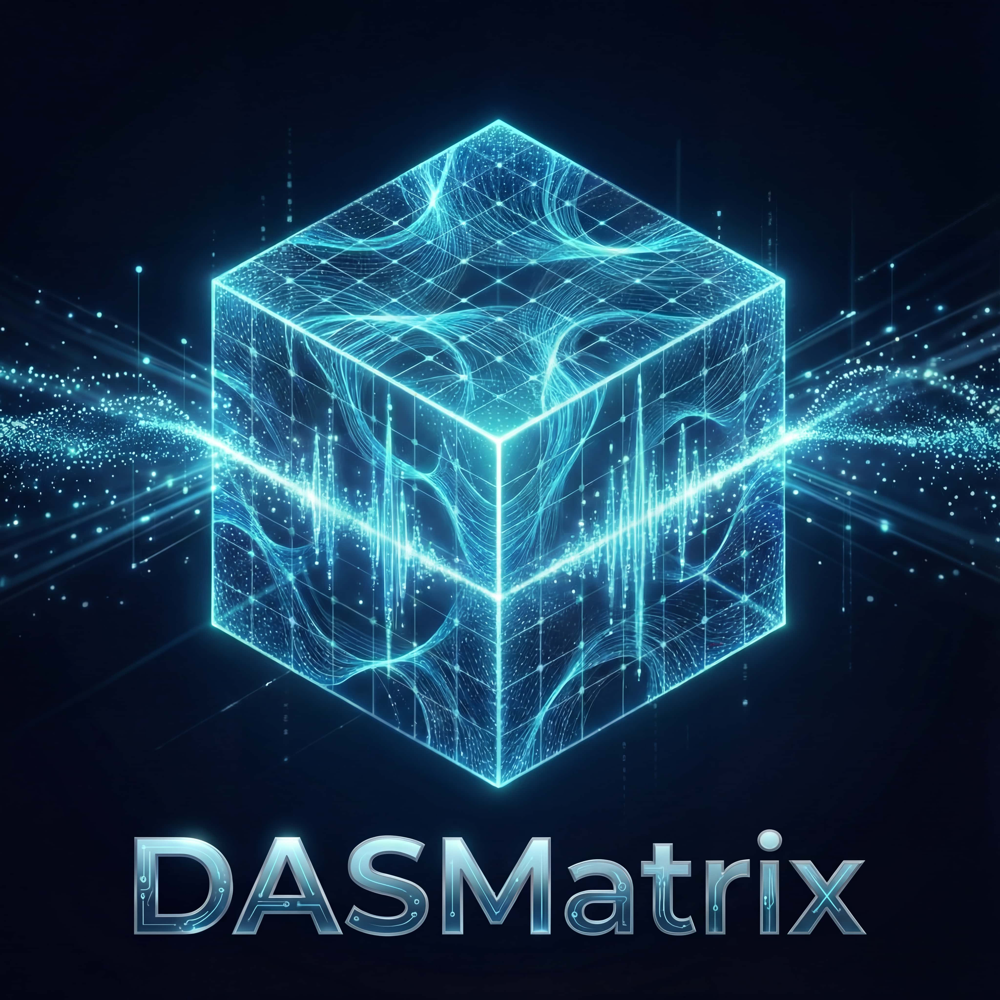

# DASMatrix

<div align="center">
  
  <h3>分布式声学传感数据处理与分析框架</h3>
  
  [](https://python.org)
  [](LICENSE)
  [](https://github.com/QIanGua/DASMatrix/actions/workflows/ci.yml)
  [](https://QIanGua.github.io/DASMatrix)
  [](README.md)
</div>

---

## 📖 项目简介

DASMatrix 是一个专为分布式声学传感（DAS）数据处理和分析设计的高性能 Python 库。该框架提供了一整套工具，用于读取、处理、分析和可视化 DAS 数据，适用于地球物理学、结构健康监测、安防监控等领域的研究和应用。

### ✨ 核心特性

- **🚀 高效数据读取**：支持 12+ 种数据格式（DAT、HDF5、PRODML、Silixa、Febus、Terra15、APSensing、ZARR、NetCDF、SEG-Y、MiniSEED、TDMS），支持 **Lazy Loading**
- **⚡ 分布式计算核心**：基于 **Xarray** 和 **Dask** 构建，支持外存处理（Out-of-Core）
- **🔗 流畅的链式 API**：通过 `DASFrame` 提供直观的信号处理工作流
- **📊 专业信号处理**：提供频谱分析、滤波、积分等多种信号处理功能
- **📈 科学级可视化**：包含时域波形图、频谱图、时频图、瀑布图等多种可视化方式
- **📏 单位系统**：通过 **Pint** 集成提供完善的物理单位支持
- **🎲 内置示例**：便捷生成合成数据（正弦波、Chirp、模拟事件）用于测试
- **🎯 高性能设计**：关键算法采用向量化和并行计算优化

## 🚀 快速开始

### 安装

#### 方式一：使用 uv (推荐)
```bash
# 克隆仓库
git clone https://github.com/QIanGua/DASMatrix.git
cd DASMatrix

# 使用 uv 安装（自动创建虚拟环境）
uv sync
```

#### 方式二：使用 pip
```bash
# 克隆仓库
git clone https://github.com/QIanGua/DASMatrix.git
cd DASMatrix

# 使用 pip 安装
pip install -e .
```

### 基本使用

#### 1. 使用 DASFrame 现代 API (推荐)
```python
from DASMatrix import df

# 创建 DASFrame（延迟加载）
frame = df.read("data.h5")

# 构建处理流程
processed = (
    frame
    .detrend(axis="time")   # 去趋势
    .bandpass(1, 500)       # 带通滤波
    .normalize()            # 归一化
)

# 执行计算
result = processed.collect()

# 快速可视化
processed.plot_heatmap(title="Processed Waterfall")
```

#### 2. 传统 API
```python
from DASMatrix.acquisition import DASReader, DataType
from DASMatrix.config import SamplingConfig

# 配置采样参数
config = SamplingConfig(
    fs=10000,      # 采样频率 10kHz
    channels=512,  # 512 个通道
    wn=5.0,        # 5Hz 高通滤波
    byte_order="big"
)

# 读取数据
reader = DASReader(config, DataType.DAT)
raw_data = reader.ReadRawData("path/to/data.dat")
```

#### 3. 可视化示例
```python
from DASMatrix.visualization import DASVisualizer
import matplotlib.pyplot as plt

# 创建可视化器
visualizer = DASVisualizer(
    output_path="./output",
    sampling_frequency=config.fs
)

# 时域波形图
visualizer.WaveformPlot(
    data[:, 100],          # 第100通道的时域数据
    time_range=(0, 10),    # 显示0-10秒
    amplitude_range=(-0.5, 0.5),
    title="Waveform Plot",
    file_name="waveform_ch100"
)

# 频谱图
visualizer.SpectrumPlot(
    data[:, 100],
    title="Spectrum Plot",
    db_range=(-80, 0),
    file_name="spectrum_ch100"
)

# 时频图
visualizer.SpectrogramPlot(
    data[:, 100],
    freq_range=(0, 500),
    time_range=(0, 10),
    cmap="inferno",
    file_name="spectrogram_ch100"
)

# 瀑布图(时间-通道)
visualizer.WaterfallPlot(
    data,
    title="Waterfall Plot",
    colorbar_label="Amplitude",
    value_range=(-0.5, 0.5),
    file_name="waterfall"
)

plt.show()
```

## 📚 文档

- **[完整文档](https://QIanGua.github.io/DASMatrix)**：完整的 API 参考和教程
- **[示例](examples/)**：实际使用示例
- **[API 参考](https://QIanGua.github.io/DASMatrix/api/)**：详细的 API 文档
- **[English Documentation](README.md)**: 英文文档

## 🏗️ 项目结构

```text
DASMatrix/
├── acquisition/           # 数据获取模块
│   ├── formats/          # 格式插件
│   └── das_reader.py     # DAS数据读取类
├── api/                   # 核心 API
│   ├── dasframe.py       # DASFrame (Xarray/Dask 后端)
│   └── df.py            # 函数式 API 入口
├── config/                # 配置模块
│   ├── sampling_config.py # 采样配置
│   └── visualization_config.py  # 可视化配置
├── processing/            # Data处理模块
│   ├── das_processor.py  # DAS处理类
│   ├── numba_filters.py  # Numba优化滤波器
│   └── engine.py         # 计算图引擎
├── visualization/         # 可视化模块
│   └── das_visualizer.py # DAS可视化类
├── units.py               # 单位系统 (基于 Pint)
├── examples.py            # 示例数据生成
└── utils/                 # 工具函数
    └── time.py           # 时间转换工具
```

## 🔧 开发

### 开发环境设置
```bash
# 安装开发依赖
uv sync --dev

# 运行测试
just test

# 运行测试
just test

# 运行性能基准测试
just benchmark

# 代码质量检查
just check-all

# 快速修复
just fix-all
```

### 代码质量工具
- **Ruff**: 代码检查和格式化
- **MyPy**: 类型检查
- **Pre-commit hooks**: 自动代码质量检查
- **GitHub Actions**: CI/CD 流水线

## 🤝 贡献

欢迎贡献代码、提出问题或建议！请通过 GitHub Issues 和 Pull Requests 参与项目开发。

### 贡献指南
1. Fork 本仓库
2. 创建功能分支 (`git checkout -b feature/amazing-feature`)
3. 提交更改 (`git commit -m 'Add amazing feature'`)
4. 推送到分支 (`git push origin feature/amazing-feature`)
5. 创建 Pull Request

## 📄 许可证

本项目采用 [MIT 许可证](LICENSE)。

## 🌟 Star 历史

[](https://star-history.com/#QIanGua/DASMatrix&Date)

---

**[🇺🇸 English](README.md)** | **[🇨🇳 中文](README_cn.md)**